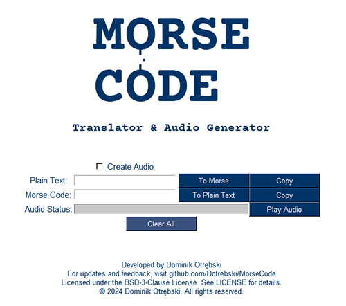

# Morse Code Translator & Audio Generator v0.6.0

This project provides a GUI application that translates text into Morse code, and vice versa, generates audio files for the Morse code, and allows playback of these audio files.

## Application Screenshot
Here's a look at the newly designed user interface:



## Features

- Translate text to Morse code.
- Translate Morse code to text.
- Generate Morse code audio files (.wav format).
- Play Morse code audio directly from the application.
- Copy text outputs to the clipboard.

## Getting Started

### Prerequisites

- Python 3.6 or higher (as determined by [Vermin](https://github.com/netromdk/vermin))
- Tkinter
- Pyperclip
- unidecode
- pycw
- playsound3

### Installation

Clone the repository to your local machine:

```bash
git clone https://github.com/Dotrebski/MorseCode.git
```

Install the required packages:

```bash
pip install -r requirements.txt
```

### Usage

Run the application:

```bash
python morse_code.py
```

## Contributing
Contributions are what make the open-source community such an amazing place to learn, inspire, and create. Any contributions you make are greatly appreciated.

1. Fork the Project
2. Create your Feature Branch
3. Commit your Changes
4. Push to the Branch
5. Open a Pull Request

## License
Distributed under the BSD-3 License. See [LICENSE](LICENSE) for more information.

## Acknowledgements
* Tkinter
* [pycw](https://github.com/bigsk05/pycw)
* [playsound3](https://github.com/sjmikler/playsound3)
* [unidecode](https://github.com/avian2/unidecode)
* [Pyperclip](https://github.com/asweigart/pyperclip)
